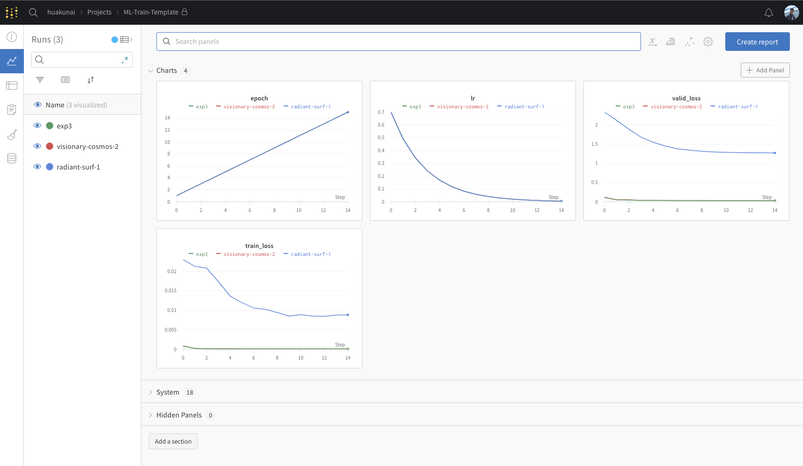

# Machine Learning General Training Template with PyTorch

This template uses wandb, if you want to use it, run `wandb login` first on your computer.


```bash
pip install -r requirements.txt
```

To run the sample code (training a simple MLP for mnist dataset).

```bash
python mnist.py --batch-size 512 -w ./workspace/exp3 -n exp3
```

The following graph will be generated on wandb after running the sample code.

